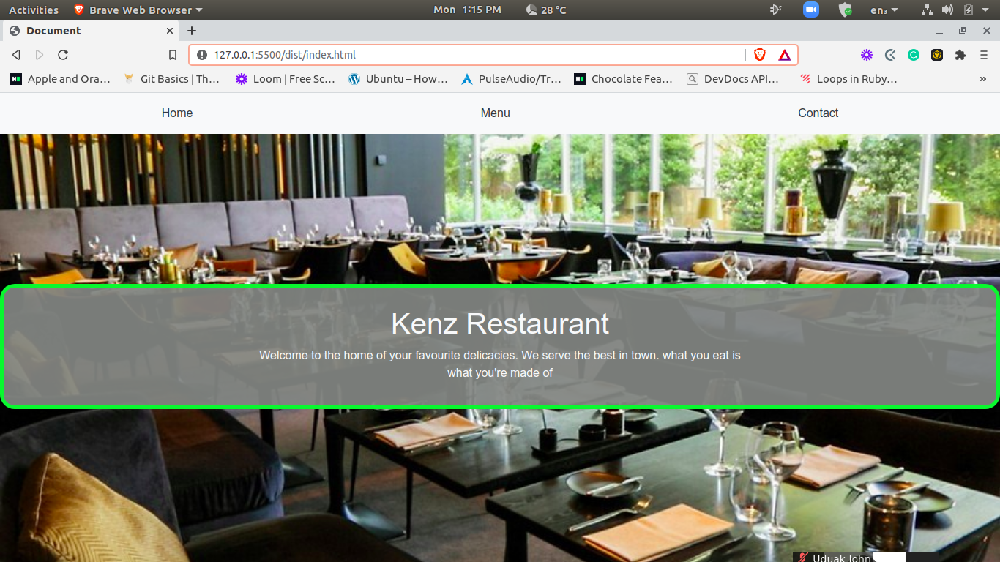

# Project Restaurant

> This project is a restaurant webpage built with JavaScript by manipulating the Document object model(DOM) to create a dynamic webpage.

## Screenshot

## Built With

- JavaScript
- HTML5
- SASS
- CSS3
- BOOTSTRAP

## Getting Started

To get a local copy up and running follow these simple example steps.

### Prerequisites

Text editor
Get a browser like chrome or firefox in their recent versions
Node.js
Node Package Manager

### Setup

- Install required dependencies `npm install`
- Run `npm start` to start the local webserver

### Usage

- Clone this Repository using the command `git@github.com:keneogu/Restaurant-page.git`
- Navigate to the directory `git checkout feature` in your code editor
- Run dist/index.html on your browser of preference. Recommended: Chrome/Firefox
- If you wish to play around the codes, navigate to this Repository in the Text Editor

### Deployment

[restaurant-js](https://keneogu.github.io/Restaurant-page/)

👤 **Kenechukwu Oguagbaka**

- GitHub: [@keneogu](https://github.com/keneogu)
- Twitter: [@keneogu](https://twitter.com/keneogu)
- LinkedIn: [@keneogu](https://www.linkedin.com/in/kene-ogu/)

## 🤝 Contributing

Contributions, issues and feature requests are welcome!

Feel free to check the [issues page](https://github.com/keneogu/Restaurant-page/issues).

## Show your support

Give a ⭐️ if you like this project!

## Acknowledgments

Microverse
The Odin Project

## 📝 License

Copyright 2021 Kene Ogu

Permission is hereby granted, free of charge, to any person obtaining a copy of this software and associated documentation files (the "Software"), to deal in the Software without restriction, including without limitation the rights to use, copy, modify, merge, publish, distribute, sublicense, and/or sell copies of the Software, and to permit persons to whom the Software is furnished to do so, subject to the following conditions:

The above copyright notice and this permission notice shall be included in all copies or substantial portions of the Software.

THE SOFTWARE IS PROVIDED "AS IS", WITHOUT WARRANTY OF ANY KIND, EXPRESS OR IMPLIED, INCLUDING BUT NOT LIMITED TO THE WARRANTIES OF MERCHANTABILITY, FITNESS FOR A PARTICULAR PURPOSE AND NONINFRINGEMENT. IN NO EVENT SHALL THE AUTHORS OR COPYRIGHT HOLDERS BE LIABLE FOR ANY CLAIM, DAMAGES OR OTHER LIABILITY, WHETHER IN AN ACTION OF CONTRACT, TORT OR OTHERWISE, ARISING FROM, OUT OF OR IN CONNECTION WITH THE SOFTWARE OR THE USE OR OTHER DEALINGS IN THE SOFTWARE.
